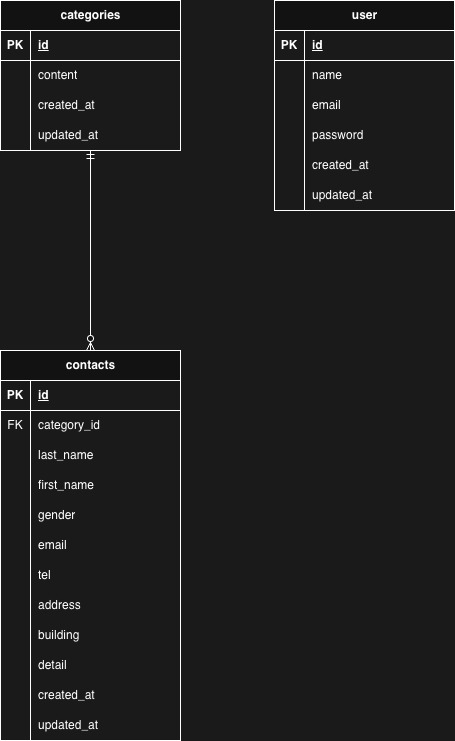

# Contact Form

## 環境構築

Dockerビルド
1. git clone
git@github.com:Estra-Coachtech/laravel-docker-template.git
2. リポジトリ名をcontact-form_testに変更
3. 新規リポジトリに紐付け先を変更
git remote set-url origin git@github.com:kinoppe/contact-form_test.git
4. docker-compose up -d --build

## Laravel 環境構築

1. docker-compose exec php bash
2. composer install
3. .cp .env.example .env , 環境変数を適宜変更
4. php artisan key:generate
5. php artisan migrate
6. php artisan db:seed

## 使用技術

・PHP 8.1.34
・Laravel 8.83.29
・MySQL 8.0.36
・nginx 1.21.1

## ER図

## URL

開発環境
・お問い合わせ画面：http://localhost/
・ユーザー登録：http://localhost/register
・phpMyAdmin：http://localhost:8080/
